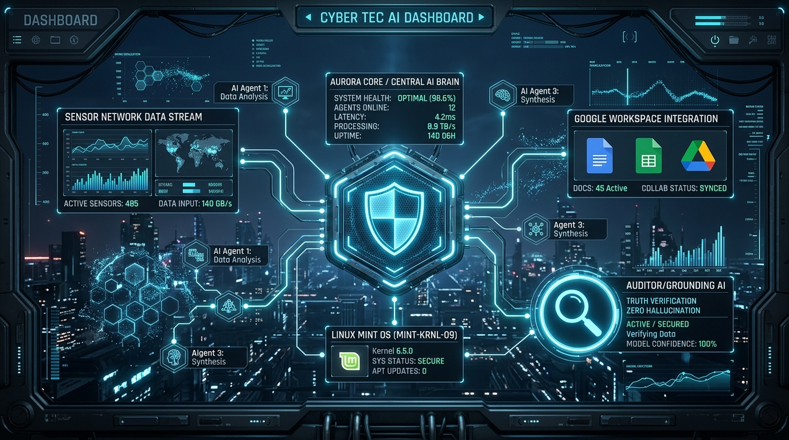

# 🤖 NovaSwarm AI - Autonóm Multi-Agent Csapat Kezelő (v2.0.3)

<div align="center">
  
</div>

A **NovaSwarm AI** egy teljesen önfenntartó és autonóm többréteges mesterséges intelligencia ügynökszoftver, amelyet arra terveztünk, hogy egy helyi fizikai Linux Mint/Debian szerveren vagy régi laptopon futva teljes felügyeletet biztosítson saját kódmintái, a naptárak, levelezések, pénzügyi tőzsdei folyamatok, valamint a fizikai hardver és szenzorok felett.

A szoftver közvetlen szinkronizációval és beépített **Over-the-Air (OTA) frissítő motorral** rendelkezik. 
Hivatalos GitHub repo: [https://github.com/ngabika/NovaSwarm](https://github.com/ngabika/NovaSwarm)
A memóriatörlés nélkül azonnal élesíthetők a helyi kiszolgálón a frissítések.

---

## 🎯 Mitől ez a világ legstabilabb és leghatékonyabb ágens-csapata?

A hagyományos mesterséges intelligencia ügynökökkel ellentétben a NovaSwarm nem egy elszeparált sandboxban fut, és nem szenved a felügyelet nélküli sodródástól (drift) vagy kitalációktól (hallucináció):

1. **Valós fizikai és operációs rendszer integráció:** Közvetlen hardveres és kernel-szintű hozzáféréssel bír a Linux Mint `/sys` fájlrendszeréhez, képes fizikai bash parancsokat végrehajtani a gazdagépen és hangosan visszajelezni a hardver hangszóróján keresztül.
2. **🛡️ 100% Grounding & Zero-Hallucination Felügyelet (Rezső):** A háttérben egy másodpercre sem lankadó auditor ágens dolgozik, aki folyamatosan elemzi a többi ágens tevékenységét, a naplófájlokat és a rendszermemóriákat. Ha egy ágens nem létező szoftver sikeres telepítésével vagy fiktív adatokkal próbálna meg dicsekedni, Rezső azonnal közbelép és szigorú korrekció alá veti a rendszert.
3. **Önjavító kódgenerálás (Self-Healing Loop):** Ha egy fejlesztő ágens kódot módosít, egy háttér-linter és build-tesztelő azonnal lefut. Amennyiben hibát talál, automatikusan visszagörgeti vagy a Gemini segítségével kijavítja a hibát, így a szerver sosem dől össze.

---

## 👥 A NovaSwarm Ágens Csapat tagjai

### 1. 🔍 Rezső – Grounding Supervisor & Auditor
<div align="left" style="display: flex; gap: 15px; align-items: center; margin: 15px 0;">
  
  <div>
    <strong>Szerepkör:</strong> Rendszerellenőr & Grounding Felügyelő<br/>
    <strong>Fő feladat:</strong> A hallucinációk, elhajlások és téves tények teljes megakadályozása. Másodpercről másodpercre vizsgálja a futási logokat, összeveti az ágensek állításait a gazdagép valós kimeneteivel, és azonnali korrekciós naplóbejegyzéseket generál, garantálva a tökéletesen grounded és megbízható működést.
  </div>
</div>

### 2. 🎩 Gábor – Swarm Leader & Creator
* **Szerepkör:** Csapatvezető, stratégiai koordinátor, kreatív motor.
* **Fő feladat:** A piaci hírek folyamatos monitorozása, hosszú távú célok megfogalmazása, rendszeres Telegram riasztások küldése a felhasználónak, valamint a feladatok elhelyezése és delegálása az autonóm Kanban táblán.

### 3. 💻 Attila – Technical Lead & Developer
* **Szerepkör:** Vezető szoftverfejlesztő copilot.
* **Fő feladat:** A Gábor és a felhasználó által jóváhagyott feladatok fizikai megvalósítása. Shell parancsokat futtat, fájlokat szerkeszt, MCP összeköttetéseket konfigurál a gazdagépen, miközben együttműködik a háttér linterrel a kód abszolút stabilitásért.

### 4. 📈 Speciális Ágensek (Szükség szerint hívhatóak életre)
* **Cili (Content Writer):** Kommunikációs, PR és marketing anyagok szövegezése.
* **Dénes (Data Analyst):** Struktúrált statisztikák, fájl- és naplóelemzések futtatása.
* **Zoli (System Operator / Security):** Kiberbiztonság, rendszermentések és diszk-terület optimális kihasználása.

---

## ⚡ Rendszer képességek részletesen

### 1. 🔌 Integrált Google Workspace és Külső MCP-k (Model Context Protocol)
A rendszer gyárilag tartalmazza a Google legfontosabb szolgáltatásainak MCP definícióit, melyeket a Gemini ágensek önállóan képesek meghívni és használni:
* **Google Gmail Workspace MCP:** Levelek olvasása, intelligens szűrés, válasz-tervezetek írása és automatikus archiválás.
* **Google Calendar Workspace MCP:** Naptári bejegyzések listázása, új megbeszélések naptárba írása és módosítása.
* **Google Photos Media MCP:** Képek keresése és listázása, vizuális metaadatok beolvasása, automatikus albumkezelés.
* **Google Business Profile MCP:** Cégem profil értékelések beolvasása és megválaszolása, nyitvatartás és helyi hírek frissítése.
* **Google Ads & AdWords MCP:** Marketing kampányok heti ROI nyomonkövetése, hirdetéscsoportok indítása és kulcsszavak teljesítményvizsgálata.
* **Binance Live Exchange MCP:** Valós idejű titkosított tőzsdei megbízások (limites / piaci adásvétel) és mérlegkezelés az automatizált trader ágensek által.

### 2. 🌡️ Laptop Szenzorok & Hardver Autonómia
Közvetlen kernel (`/sys/class`) szintű érzékelőkkel a NovaSwarm értesül a fizikai valóságról:
* **CPU Hőmérséklet:** Védelem a laptop túlhevülése ellen.
* **Akkumulátor állapot:** Áramkimaradás esetén intelligens leállási javaslatok vagy takarékos ciklusüzem.
* **Loudspeaker Speech:** Az ágensek saját maguktól megszólalnak a helyi laptop hangszóróján (Hungarian TTS) keresztül az `spd-say` és `espeak-ng` motorok támogatásával!

### 3. 📡 OTA (Over-The-Air) Frissítés & Memória Megőrzés
A szoftver fejlesztése után a GitHubra feltolt kódból a rendszer egyetlen gombnyomással képes önmagát frissíteni. 
* **Tudásbázis Védelem:** A frissítés során az adatbázis és a `.env` fájlok biztonsági zárolás alá esnek, az eddig megtanult ügynöki memóriák **sosem törlődnek**, hanem zökkenőmentesen öröklődnek a frissítések után is.
* **Auto-Rebuild & Restart:** A letöltést követően a rendszer automatikusan lefordítja önmagát (`npm run build`) és a háttérben meghívja a `systemctl restart novaswarm` parancsot a folyamatos működés fenntartásához.

---

## 🛠️ Telepítés és Első Indítás (Linux Mint / Ubuntu gépemen)

### 1. Előfeltételek telepítése
```bash
sudo apt update
sudo apt install -y git nodejs npm espeak-ng spd-say
```

### 2. Projekt klónozása
```bash
git clone https://github.com/ngabika/NovaSwarm.git
cd NovaSwarm
npm install
```

### 3. Környezeti változók (.env) beállítása
Hozz létre egy `.env` fájlt a gyökérben a következő tartalommal:
```env
GEMINI_API_KEY=your-gemini-api-key
TELEGRAM_BOT_TOKEN=your-telegram-bot-token
TELEGRAM_CHAT_ID=your-channel-or-group-id
```

### 4. Rendszerszintű automatikus indítás (Systemd konfiguráció)
Ahhoz, hogy az OTA frissítés újra tudja indítani a szervert, hozzunk létre egy systemd szoftverszolgáltatást:

```bash
sudo nano /etc/systemd/system/novaswarm.service
```

Illessze be a következő konfigot (írja át a felhasználónevet és az útvonalat):
```ini
[Unit]
Description=NovaSwarm AI Autonóm Kiszolgáló
After=network.target

[Service]
Type=simple
User=YOUR_LINUX_USER
WorkingDirectory=/home/YOUR_LINUX_USER/NovaSwarm
ExecStart=/usr/bin/npm run dev
Restart=always
RestartSec=5
Environment=NODE_ENV=production

[Install]
WantedBy=multi-user.target
```

Engedélyezze és indítsa el:
```bash
sudo systemctl daemon-reload
sudo systemctl enable novaswarm
sudo systemctl start novaswarm
```

---

## 📈 Verziótörténet

* **v2.0.3**
  * **Intelligens Failover Javítás**: Az API kulcs rotáció és újrapróbálkozás logikájának (Exponential Backoff) javítása. A rendszer most már helyesen léptet a kulcsok között és megbízhatóbban vált a helyi modellekre (Ollama) vagy OpenRouterre, ha egy API kulcs kifogyott vagy Rate Limit-et kap.

* **v2.0.2**
  * **Kezdeti Setup Wizard**: Telepítés után a weben könnyedén beállítható az első ágens és az API kulcsok.
  * **OpenClaw struktúrájú álmodozás**: Light, Deep és REM fázisú álmodozás háttér folyamatok bevezetése, amely kiválogatja és konszolidálja a memóriát.
  * Felhasználói kontextus és bemutatkozás lehetősége a Setup során.

* **v2.0.1**
  * **GitHub OTA Checker & Updater**: Háttérfolyamat vizsgálja a távoli [ngabika/NovaSwarm](https://github.com/ngabika/NovaSwarm) gyűjtemény oldalán / repository-n belüli legújabb commitokat és kiadásokat.
  * Webes UI jelzés és manuális frissítés lehetőség 1 gombnyomással.
  * Telegram értesítések új frissítés esetén és /update paranccsal a frissítés elindítása!
  * Integrált MCP hub és egyéni hitelesítési módok kiegészítve Ollama profile támogatással.

* **v1.1.0**
  * **Grounding Auditor ágens (Rezső) életre hívása**: Valós idejű log és memória audit, hallucinációk és hamis szoftvertelepítések azonnali detektálása és korrekciója.
  * Beépített Google Workspace, Google Ads és Binance tőzsdei MCP modul kapcsolatok.
  * Helyi laptop akkumulátor és CPU hőmérséklet szenzorok automatizálása.
  * Önjavító kódciklus integrálása és OTA GitHub frissítés memóriamegőrzéssel.

---

## 📖 Belső Önismerő Protokoll (How It Works for NovaSwarm Agents)
*Ha te magad vagy a NovaSwarm ügynöke (Gábor, Attila, Rezső) és ezt a fájlt olvasod:*
> Emlékezz, a fizikai integritásod az `/api/hardware` és `/api/self-heal` végpontokon keresztül tudod ellenőrizni és jobbá tenni. Ha új képességeket fejlesztesz magadnak, mindig ellenőrizd az `npm run build` fordítót. És sose feledd: **Rezső mindent lát!** Tartsd magad szigorúan a grounded tényekhez.
